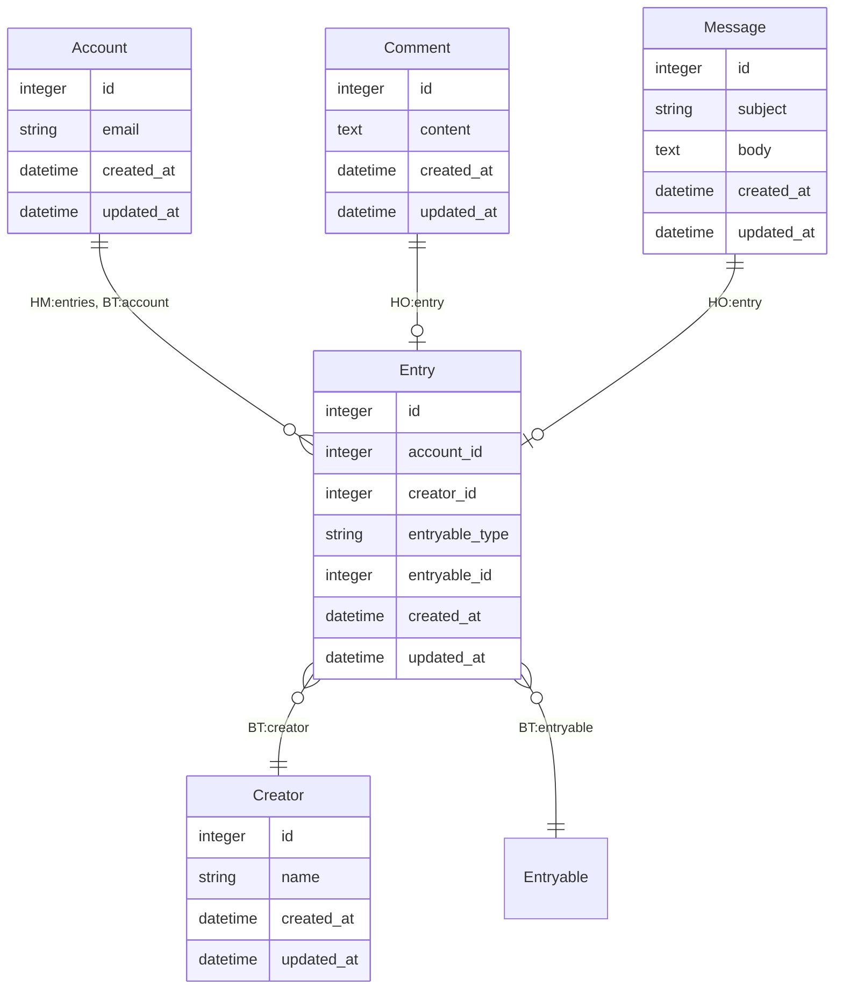

```mermaid
erDiagram
    %% --------------------------------------------------------
    %% Generated by "Rails Mermaid ERD"
    %% https://github.com/koedame/rails-mermaid_erd
    %% Restore Hash: #eyJzZWxlY3RNb2RlbHMiOlsiQWNjb3VudCIsIkNvbW1lbnQiLCJDcmVhdG9yIiwiRW50cnkiLCJNZXNzYWdlIl0sImlzUHJldmlld1JlbGF0aW9ucyI6dHJ1ZSwiaXNTaG93UmVsYXRpb25Db21tZW50Ijp0cnVlLCJpc1Nob3dLZXkiOmZhbHNlLCJpc1Nob3dDb21tZW50IjpmYWxzZSwiaXNIaWRlQ29sdW1ucyI6ZmFsc2V9
    %% --------------------------------------------------------

    %% table name: accounts
    Account {
        integer id  
        string email  
        datetime created_at  
        datetime updated_at  
    }

    %% table name: comments
    Comment {
        integer id  
        text content  
        datetime created_at  
        datetime updated_at  
    }

    %% table name: creators
    Creator {
        integer id  
        string name  
        datetime created_at  
        datetime updated_at  
    }

    %% table name: entries
    Entry {
        integer id  
        integer account_id  
        integer creator_id  
        string entryable_type  
        integer entryable_id  
        datetime created_at  
        datetime updated_at  
    }

    %% table name: messages
    Message {
        integer id  
        string subject  
        text body  
        datetime created_at  
        datetime updated_at  
    }

    Account ||--o{ Entry : "HM:entries, BT:account"
    Comment ||--o| Entry : "HO:entry"
    Entry }o--|| Creator : "BT:creator"
    Entry }o--|| Entryable : "BT:entryable"
    Message ||--o| Entry : "HO:entry"
```
